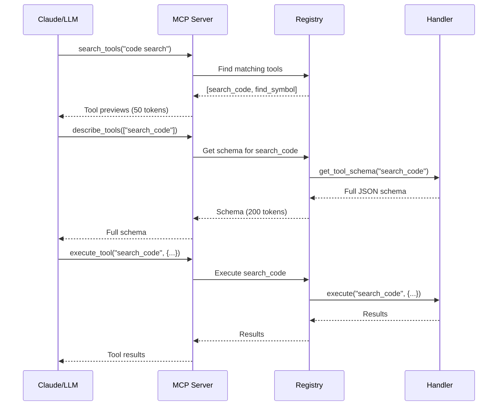

# Architecture Documentation

Unified MCP Server - Technical Architecture and Design

## Table of Contents

- [Overview](#overview)
- [System Architecture](#system-architecture)
- [Core Components](#core-components)
- [Progressive Discovery](#progressive-discovery)
- [Capability Integration](#capability-integration)
- [Data Flow](#data-flow)
- [Performance Optimizations](#performance-optimizations)
- [Security Considerations](#security-considerations)

## Overview

The Unified MCP Server consolidates multiple MCP capabilities into a single server with intelligent progressive discovery to dramatically reduce token usage.

### Design Goals

1. **Token Efficiency**: Reduce context window usage from 10,000+ tokens to 50-200 tokens
2. **Modularity**: Each capability can be enabled/disabled independently
3. **Extensibility**: Easy to add new capabilities via handler pattern
4. **Performance**: Sub-10ms response for common operations
5. **Developer Experience**: Simple configuration, comprehensive testing

### Key Metrics

- **Token Reduction**: 96-160x (from 10,000+ to 50-200 tokens)
- **Capabilities**: 5 integrated (Codanna, Context7, Playwright, Claude-mem, Graphiti)
- **Tools**: 19 total across all capabilities
- **Test Coverage**: 80%+ with unit, integration, and E2E tests

## System Architecture

### High-Level Architecture

```
┌─────────────────────────────────────────────────────────────┐
│                    Claude / LLM Client                       │
└─────────────────────────────────────────────────────────────┘
                              ↓
                    MCP Protocol (stdio)
                              ↓
┌─────────────────────────────────────────────────────────────┐
│                   Unified MCP Server                         │
│  ┌───────────────────────────────────────────────────────┐  │
│  │         Progressive Discovery Engine                   │  │
│  │  - Search Tools (50 tokens)                           │  │
│  │  - Describe Tools (200 tokens)                        │  │
│  │  - Execute Tool (variable)                            │  │
│  └───────────────────────────────────────────────────────┘  │
│  ┌───────────────────────────────────────────────────────┐  │
│  │          Dynamic Tool Registry                         │  │
│  │  - Lazy loading                                       │  │
│  │  - Tool caching                                       │  │
│  │  - Schema management                                  │  │
│  └───────────────────────────────────────────────────────┘  │
│  ┌───────────────────────────────────────────────────────┐  │
│  │         Capability Handlers                            │  │
│  │  ┌─────────┐ ┌─────────┐ ┌──────────┐ ┌──────────┐  │  │
│  │  │ Codanna │ │Context7 │ │Playwright│ │Claude-mem│  │  │
│  │  └─────────┘ └─────────┘ └──────────┘ └──────────┘  │  │
│  │  ┌───────────┐                                        │  │
│  │  │ Graphiti  │                                        │  │
│  │  └───────────┘                                        │  │
│  └───────────────────────────────────────────────────────┘  │
└─────────────────────────────────────────────────────────────┘
                              ↓
         ┌──────────────────────────────────────┐
         │   External Services / Submodules      │
         │  - Codanna (Rust binary)              │
         │  - Context7 (npx MCP server)          │
         │  - Playwright (npx MCP server)        │
         │  - Claude-mem (HTTP API + DB)         │
         │  - LadybugDB (embedded graph DB)      │
         └──────────────────────────────────────┘
```

### Component Layers

1. **Protocol Layer**: MCP stdio communication
2. **Discovery Layer**: Progressive tool discovery
3. **Registry Layer**: Dynamic tool management
4. **Handler Layer**: Capability integration
5. **Service Layer**: External integrations

## Core Components

### 1. Progressive Discovery Engine

**Location**: `core/progressive_discovery.py`

Implements the 3-step discovery pattern:

```python
class ProgressiveDiscovery:
    async def search_tools(self, query: str) -> List[ToolPreview]:
        """Step 1: Return minimal tool previews (50 tokens)"""
        
    async def describe_tools(self, tool_names: List[str]) -> List[ToolSchema]:
        """Step 2: Return full schemas for selected tools (200 tokens each)"""
        
    async def execute_tool(self, tool_name: str, args: dict) -> Any:
        """Step 3: Execute the tool"""
```

**Token Estimates**:
- Search: ~50 tokens total
- Describe: ~200 tokens per tool
- Execute: Variable based on results

### 2. Dynamic Tool Registry

**Location**: `core/dynamic_registry.py`

Manages tool lifecycle and caching:

```python
class DynamicToolRegistry:
    def __init__(self):
        self.tools: Dict[str, ToolDefinition] = {}
        self.handlers: Dict[str, CapabilityHandler] = {}
        self.cache: Dict[str, Any] = {}
    
    async def register_capability(self, name: str, handler: CapabilityHandler):
        """Register a new capability with lazy loading"""
        
    async def get_tool_schema(self, tool_name: str) -> dict:
        """Get schema with caching"""
        
    async def execute_tool(self, tool_name: str, args: dict) -> Any:
        """Execute tool via handler"""
```

**Features**:
- Lazy loading: Tools loaded only when needed
- Schema caching: Reduce redundant schema requests
- Handler pooling: Reuse handler instances
- Validation: Automatic argument validation

### 3. Capability Loader

**Location**: `core/capability_loader.py`

Abstract base class for all capability handlers:

```python
class CapabilityHandler(ABC):
    @abstractmethod
    async def initialize(self) -> None:
        """Initialize the capability"""
    
    @abstractmethod
    async def get_tool_schema(self, tool_name: str) -> dict:
        """Get JSON schema for a tool"""
    
    @abstractmethod
    async def execute(self, tool_name: str, arguments: dict) -> dict:
        """Execute a tool"""
    
    async def cleanup(self) -> None:
        """Cleanup resources (optional)"""
```

### 4. Catalog Manager

**Location**: `core/catalog.py`

Loads and validates configuration from `config/catalog.yaml`:

```yaml
capabilities:
  code_understanding:
    enabled: true
    type: codanna
    source: capabilities/codanna
    tools: [search_code, get_call_graph, find_symbol, find_implementations]
    lazy_load: true
    description: "Semantic code search and analysis"
```

**Features**:
- YAML configuration
- Capability toggling
- Tool metadata
- Lazy load configuration

## Progressive Discovery

### Token Economics

**Traditional MCP Server**:
```
All 19 tools loaded upfront:
- 19 tools × 500 tokens/tool = 9,500 tokens
- Plus server metadata = ~10,000 tokens total
```

**Unified MCP with Progressive Discovery**:
```
Step 1 - Search:
- 19 tool previews (name + 1-line description)
- ~50 tokens total

Step 2 - Describe:
- Only requested tools get full schemas
- Example: 2 tools × 200 tokens = 400 tokens

Step 3 - Execute:
- Variable based on results
- Typical: 100-500 tokens

Total: 50 + 400 + 300 = 750 tokens
Reduction: 93% (from 10,000 to 750)
```

### Discovery Flow



## Capability Integration

### Integration Patterns

There are three integration patterns used:

#### 1. Subprocess Integration (Codanna)

**When to use**: For standalone binaries

```python
async def execute(self, tool_name: str, arguments: dict):
    process = await asyncio.create_subprocess_exec(
        "codanna",
        "search",
        stdin=subprocess.PIPE,
        stdout=subprocess.PIPE,
    )
    stdout, _ = await process.communicate(input=query.encode())
    return json.loads(stdout)
```

#### 2. MCP JSON-RPC Integration (Context7, Playwright)

**When to use**: For Node.js MCP servers

```python
async def execute(self, tool_name: str, arguments: dict):
    request = {
        "jsonrpc": "2.0",
        "method": "tools/call",
        "params": {"name": tool_name, "arguments": arguments},
        "id": 1
    }
    
    process = await asyncio.create_subprocess_exec(
        "npx", "-y", self.package_name,
        stdin=subprocess.PIPE,
        stdout=subprocess.PIPE,
    )
    
    stdout, _ = await process.communicate(input=json.dumps(request).encode())
    return json.loads(stdout)
```

#### 3. HTTP API Integration (Claude-mem)

**When to use**: For HTTP-based services

```python
async def execute(self, tool_name: str, arguments: dict):
    async with httpx.AsyncClient() as client:
        response = await client.post(
            f"{self.api_url}/api/search",
            json=arguments
        )
        return response.json()
```

#### 4. Library Integration (Graphiti + LadybugDB)

**When to use**: For Python libraries

```python
async def execute(self, tool_name: str, arguments: dict):
    driver = LadybugDriver(db_path=self.db_path)
    graphiti = Graphiti(
        graph_driver=driver,
        llm_client=OpenAIClient(),
    )
    
    result = await graphiti.search(query, num_results=limit)
    return format_results(result)
```

### Handler Implementation Pattern

All handlers follow this pattern:

```python
class MyCapabilityHandler(CapabilityHandler):
    def __init__(self, config: dict):
        super().__init__(config)
        self.resource = None
    
    async def initialize(self) -> None:
        """One-time setup"""
        self.resource = await create_resource()
    
    async def get_tool_schema(self, tool_name: str) -> dict:
        """Return JSON schema"""
        return SCHEMAS[tool_name]
    
    async def execute(self, tool_name: str, arguments: dict) -> dict:
        """Execute tool"""
        if tool_name == "my_tool":
            return await self._my_tool(arguments)
    
    async def _my_tool(self, args: dict) -> dict:
        """Tool implementation"""
        result = await self.resource.do_something(args)
        return {"status": "success", "result": result}
    
    async def cleanup(self) -> None:
        """Cleanup resources"""
        if self.resource:
            await self.resource.close()
```

## Data Flow

### Request Processing

```
1. MCP Request arrives via stdio
   ↓
2. Server parses JSON-RPC request
   ↓
3. Progressive Discovery Engine routes request
   ↓
4. Dynamic Registry looks up handler
   ↓
5. Handler executes tool
   ↓
6. Results formatted as JSON-RPC response
   ↓
7. Response sent via stdio
```

### Caching Strategy

```python
# Schema caching
schema_cache: Dict[str, Tuple[dict, float]] = {}

async def get_tool_schema(self, tool_name: str) -> dict:
    if tool_name in self.schema_cache:
        schema, timestamp = self.schema_cache[tool_name]
        if time.time() - timestamp < 3600:  # 1 hour TTL
            return schema
    
    schema = await self.handler.get_tool_schema(tool_name)
    self.schema_cache[tool_name] = (schema, time.time())
    return schema
```

## Performance Optimizations

### 1. Lazy Loading

Capabilities are only initialized when first used:

```python
async def get_handler(self, capability_name: str):
    if capability_name not in self.initialized:
        handler = self.handlers[capability_name]
        await handler.initialize()
        self.initialized.add(capability_name)
    return self.handlers[capability_name]
```

### 2. Parallel Execution

Multiple tools can be executed in parallel:

```python
results = await asyncio.gather(*[
    self.execute_tool(tool_name, args)
    for tool_name, args in tool_requests
])
```

### 3. Connection Pooling

HTTP clients are reused:

```python
class ClaudeMemHandler:
    def __init__(self):
        self.http_client = httpx.AsyncClient(timeout=30.0)
    
    async def cleanup(self):
        await self.http_client.aclose()
```

### 4. Schema Caching

Schemas are cached to avoid repeated lookups.

## Security Considerations

### 1. Input Validation

All tool arguments are validated against JSON schemas:

```python
from jsonschema import validate

def validate_arguments(args: dict, schema: dict):
    validate(instance=args, schema=schema)
```

### 2. Subprocess Sandboxing

External processes run with limited privileges:

```python
process = await asyncio.create_subprocess_exec(
    binary_path,
    *args,
    stdin=subprocess.PIPE,
    stdout=subprocess.PIPE,
    stderr=subprocess.PIPE,
    # No shell=True to prevent injection
)
```

### 3. Resource Limits

Timeouts prevent runaway processes:

```python
try:
    result = await asyncio.wait_for(
        self.execute_tool(tool_name, args),
        timeout=30.0
    )
except asyncio.TimeoutError:
    raise RuntimeError("Tool execution timeout")
```

### 4. API Key Protection

Sensitive credentials are environment variables:

```python
OPENAI_API_KEY = os.getenv("OPENAI_API_KEY")
if not OPENAI_API_KEY:
    raise ValueError("OPENAI_API_KEY required")
```

## Testing Strategy

### Test Pyramid

```
         ┌─────────┐
         │   E2E   │  (10%)  - Full server workflow
         ├─────────┤
         │ Integration │ (30%)  - Handler + external service
         ├─────────────┤
         │    Unit     │ (60%)  - Core logic, isolated
         └─────────────┘
```

### Test Coverage

- **Unit Tests**: Core logic (progressive discovery, registry)
- **Integration Tests**: Each capability handler
- **E2E Tests**: Full MCP server workflow

Target: 80%+ code coverage

## Future Enhancements

1. **Tool Composition**: Chain multiple tools in single request
2. **Caching Layer**: Redis for distributed caching
3. **Metrics**: Prometheus metrics for monitoring
4. **Rate Limiting**: Per-capability rate limits
5. **Plugin System**: Dynamic capability loading at runtime

## References

- [MCP Specification](https://modelcontextprotocol.io/)
- [JSON-RPC 2.0](https://www.jsonrpc.org/specification)
- [Docker MCP Gateway Pattern](https://github.com/docker/mcp-gateway)
